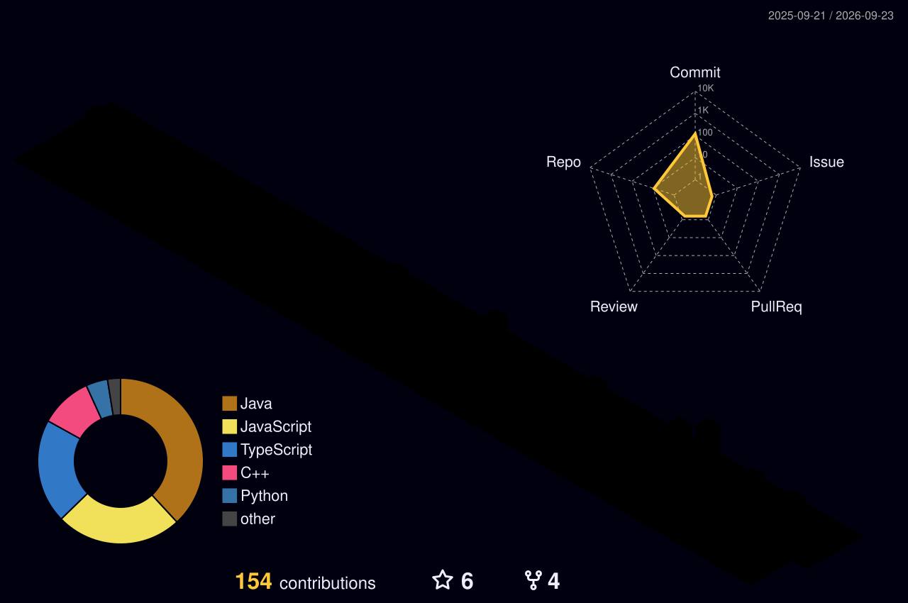

<!--
═══════════════════════════════════════════════════════════════════════════════
  SOHAN SARKAR — github.com/SSarkar0307
  Six values still need filling. Search for  «FILL»  — that's all of them.
  Setup order + what breaks: SETUP.md
  Palette — ink #0D1117 · marigold #F0A202 · ember #D64933 · slate #8B949E
═══════════════════════════════════════════════════════════════════════════════
-->

<picture>
  <source media="(prefers-color-scheme: dark)"  srcset="./assets/header.svg">
  <source media="(prefers-color-scheme: light)" srcset="./assets/header-light.svg">
  
</picture>

 

 

 

## ▌ Who

I build backends — specifically the parts that have to stay correct once things go concurrent.
Event-driven services, message queues, caches, and the design work underneath them: where state
lives, what the interfaces promise, and what happens when a node comes back after being gone for
ten minutes.

Three things have most of my attention right now.

**Distributed systems.** I'm building a collaboration platform on CRDTs and a Kafka event bus,
where the interesting work is the reconnect path and the conflict resolution, not the happy path.

**System design, especially low-level.** I work through LLD problems in the open and write down the
reasoning — why this abstraction, what breaks at scale — rather than just committing the class
diagram. It's the part of engineering I find genuinely fun.

**Infrastructure.** Publish-and-distribute pipelines, storage layers, versioning, the plumbing that
everything else assumes works.

Most recently I was a **backend developer intern at [OpsAI](https://www.linkedin.com/company/opsai)**,
building the APIs and governance pipelines between AI agents and enterprise systems — role-based
approvals, policy checks, risk classification, audit trails. Compliance code is unglamorous and
completely unforgiving, which turned out to be good training.

Competitive programming is where the instinct came from. 1000+ problems solved, LeetCode Knight at
1880+. It taught me to go looking for the input that breaks something before I go looking for the
one that works — which is most of what backend engineering turns out to be.

Studying **Electrical & Computer Engineering at Jamia Millia Islamia** and **BS Data Science at
IIT Madras**, concurrently, since 2024.

**→ Fastest way to reach me: [sarkarsohan.3706@gmail.com](mailto:sarkarsohan.3706@gmail.com)**

 

## ▌ Now

Last reviewed <b>August 2026</b>.

| | |
|:--|:--|
| **Building** | «GOTHAM» — an event-driven workspace for engineering teams. CRDT collaborative editing, Kafka event bus, OpenSearch, and a knowledge graph that links docs to the PRs, incidents and ADRs behind them. Public in 1–2 months. |
| **Recently shipped** | AI-execution governance at OpsAI — policy engine, risk classification, audit logging |
| **Practising daily** | Low-level design problems → [`Low-Level-Design`](https://github.com/SSarkar0307/Low-Level-Design) |
| **Learning** | Distributed consensus and CRDTs, properly rather than by vibes |
| **Open to** | Backend / distributed-systems roles — available now |

 

## ▌ Ship log

<!-- «FILL» Add two more pins here if NavVision / the YouTube classifier have public repos.
     Copy a block above and change &repo=<name> and the href. If they don't exist as
     public repos, leave this at two — two real cards beat four broken ones. -->

 

**`npm-package-upload-infra`** — Publish-and-distribute infrastructure for npm packages: the upload
path, versioning, and the storage layer behind it. `Node.js` · `AWS`

**`Low-Level-Design`** — Working through LLD interview problems in the open — parking lot, rate
limiter, elevator, and the rest — with the design reasoning written down, not just the code.
Updated most weeks. `Java/C++` · `design patterns`

 

### In progress — «GOTHAM»

An event-driven collaboration workspace built for engineering teams specifically, not a Notion clone.
The thesis is that **everything should be connected**: a document knows about the pull requests,
incidents, ADRs and people attached to it, so you can ask *why* an architectural decision was made
and trace the answer.

| | |
|:--|:--|
| **Real-time** | CRDT-based collaborative editing — concurrent writes, conflict resolution, offline edits, presence, version history |
| **Event bus** | Kafka. Page edits, uploads, comments and tasks emit events; notification, search, analytics and audit services consume independently |
| **State** | Redis for sessions, caching, rate limiting, distributed locks and Pub/Sub presence |
| **Search** | OpenSearch, populated asynchronously off the event stream |
| **Storage** | S3 + CloudFront |
| **AI** | A subsystem, not the pitch — semantic search, summaries, "ask this workspace" |

Deliberately built in slices rather than all at once. Repo goes public when the collaborative
editing layer survives a reconnect storm.

 

## ▌ Competitive

| | |
|:--|:--|
| 🥇 | **1st** — Paradox ML Challenge (Freshers) |
| 🥇 | **1st of 200** — ACPC 2K25, ICPC-style contest, ABES College of Engineering |
| 🥇 | **Winner** — Debug Arena 2026, DSA contest, ARSDC Delhi University |
| 🥈 | **2nd runner-up** — Synapse-AI'26, AI×Sports hackathon at DTU, 350+ participants |
| 🎖 | **Finalist** — HackJMI 2025 (NavVision, CV navigation aid for the visually impaired) |
| 🎖 | **Runner-up** — Algo Clash 3X, GDG JMI |
| 🎖 | **Finalist** in Several Other Hackathons & Contests...|

 

## ▌ Telemetry

<picture>
  <source media="(prefers-color-scheme: dark)"  srcset="https://github-stats-extended.vercel.app/api?username=SSarkar0307&show_icons=true&include_all_commits=true&rank_icon=percentile&hide_border=true&bg_color=00000000&title_color=F0A202&text_color=C9D1D9&icon_color=D64933&ring_color=F0A202&custom_title=Contribution%20readout">
  <source media="(prefers-color-scheme: light)" srcset="https://github-stats-extended.vercel.app/api?username=SSarkar0307&show_icons=true&include_all_commits=true&rank_icon=percentile&hide_border=true&bg_color=00000000&title_color=B87400&text_color=57606A&icon_color=B0341F&ring_color=B87400&custom_title=Contribution%20readout">
  
</picture>

<picture>
  <source media="(prefers-color-scheme: dark)"  srcset="https://github-stats-extended.vercel.app/api/top-langs/?username=SSarkar0307&layout=donut&langs_count=6&size_weight=0.5&count_weight=0.5&hide_border=true&bg_color=00000000&title_color=F0A202&text_color=C9D1D9&custom_title=Where%20the%20bytes%20go">
  <source media="(prefers-color-scheme: light)" srcset="https://github-stats-extended.vercel.app/api/top-langs/?username=SSarkar0307&layout=donut&langs_count=6&size_weight=0.5&count_weight=0.5&hide_border=true&bg_color=00000000&title_color=B87400&text_color=57606A&custom_title=Where%20the%20bytes%20go">
  
</picture>

<!--
  ┌─ BULLETPROOF MODE ──────────────────────────────────────────────────────┐
  │ The two cards above hit a public API that can rate-limit. The `cards`   │
  │ job in .github/workflows/profile.yml generates the same SVGs INTO this  │
  │ repo, where GitHub serves them itself and they can never 429.           │
  │ Once that job has run, delete the two picture blocks and uncomment:   │
  └─────────────────────────────────────────────────────────────────────────┘

-->

  

  

<b>▌ More telemetry</b> — the year as a city, the year as lunch, per-language breakdowns

 

  

<picture>
  <source media="(prefers-color-scheme: dark)"  srcset="https://raw.githubusercontent.com/SSarkar0307/SSarkar0307/output/snake-dark.svg">
  <source media="(prefers-color-scheme: light)" srcset="https://raw.githubusercontent.com/SSarkar0307/SSarkar0307/output/snake.svg">
  
</picture>

  

  

 

## ▌ Stack

Ordered by what I'd reach for first, not alphabetically.

<table>
<tr>
<td width="160"><b>Backend</b></td>
<td>

 Also <b>Fastify</b> · REST API design · async processing
</td>
</tr>
<tr>
<td><b>Distributed &amp; data</b></td>
<td>

 Also <b>OpenSearch</b> · CRDTs · event-driven architecture · distributed locks
</td>
</tr>
<tr>
<td><b>Cloud &amp; infra</b></td>
<td>

 S3 · CloudFront · CI/CD
</td>
</tr>
<tr>
<td><b>Languages</b></td>
<td>

 C++ / Python for contests, Java for LLD, JS/TS for everything else
</td>
</tr>
<tr>
<td><b>Design</b></td>
<td>
Low-level design · design patterns · system design · API contracts
</td>
</tr>
<tr>
<td><b>Frontend</b> secondary</td>
<td>

 GSAP · WebGL shaders · Locomotive Scroll — motion-heavy client work
</td>
</tr>
<tr>
<td><b>ML</b> coursework</td>
<td>

 LSTM classification · YOLO object detection
</td>
</tr>
</table>

 

<b>▌ Recent activity</b>

 

<!--START_SECTION:activity-->
<!-- Auto-filled by the `activity` job on first run. -->
<!--END_SECTION:activity-->

 

## ▌ Working together

I'm looking for backend and distributed-systems work and I'm available now. If you're building
something where correctness under concurrency actually matters — event pipelines, real-time state,
anything with a hard consistency story — I'd like to hear about it.

 

  
<i>"The bug is in the case you didn't write a test for."</i>

